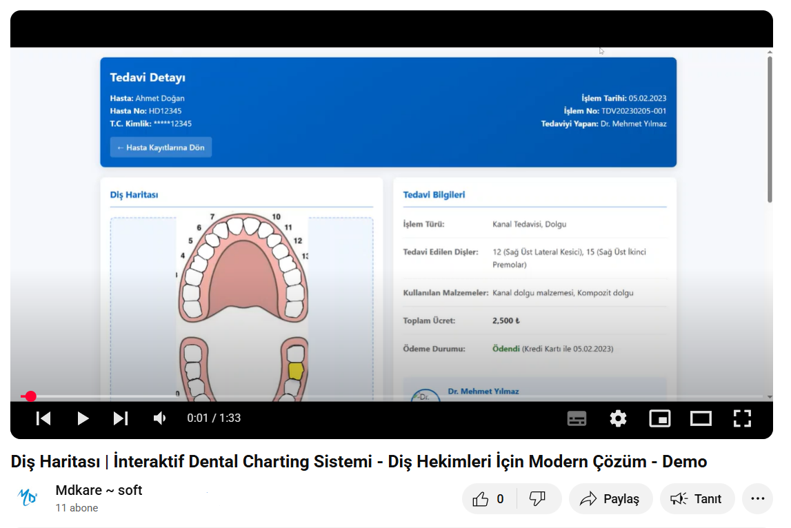

# 🦷 Diş Haritası - Dental Charting System

<div align="center">
  
  
  <p align="center">
    <b>Modern, İnteraktif ve Kullanıcı Dostu Diş Hekimliği Uygulaması</b>
  </p>
  
  <p align="center">
    <a href="#-özellikler"><strong>Özellikler</strong></a> •
    <a href="#-teknolojiler"><strong>Teknolojiler</strong></a> •
    <a href="#-kurulum"><strong>Kurulum</strong></a> •
    <a href="#-ekran-görüntüleri"><strong>Ekran Görüntüleri</strong></a> •
    <a href="#-teknik-detaylar"><strong>Teknik Detaylar</strong></a>
  </p>
</div>

## 📋 Proje Tanımı

Diş Haritası, diş hekimlerinin hasta tedavi kayıtlarını interaktif bir şekilde tutabilecekleri modern ve kullanıcı dostu bir web uygulamasıdır. SVG tabanlı diş haritası üzerinden tedavi edilen dişlerin işaretlenmesini, detaylı notların kaydedilmesini ve hastaların geçmiş tedavi kayıtlarının yönetilmesini sağlar.

### ✨ Demo

<div align="center">
  <a href="https://youtu.be/kmRgvLQL28g">
    
  </a>
  <p><a href="">🎬 Detaylı tanıtım videosunu izlemek için tıklayın</a></p>
</div>

## 🚀 Özellikler

<div align="center">
  <table>
    <tr>
      <td align="center" width="33%">
        <br/>
        <b>İnteraktif SVG Diş Haritası</b><br/>
        <small>Dişlere tıklayarak not ekleyebilme</small>
      </td>
      <td align="center" width="33%">
        <br/>
        <b>Tedavi Notları</b><br/>
        <small>Her diş için özel tedavi notları</small>
      </td>
      <td align="center" width="33%">
        <br/>
        <b>Hasta Geçmişi</b><br/>
        <small>Kronolojik işlem kaydı</small>
      </td>
    </tr>
    <tr>
      <td align="center" width="33%">
        <br/>
        <b>Görsel Efektler</b><br/>
        <small>Seçilen dişler için animasyonlar</small>
      </td>
      <td align="center" width="33%">
        <br/>
        <b>Responsive Tasarım</b><br/>
        <small>Mobil ve masaüstü uyumlu</small>
      </td>
      <td align="center" width="33%">
        <br/>
        <b>Detaylı Raporlama</b><br/>
        <small>Kapsamlı tedavi raporları</small>
      </td>
    </tr>
  </table>
</div>

## 🛠️ Teknolojiler

Proje aşağıdaki web teknolojilerini kullanmaktadır:

<div align="center">
  <table>
    <tr>
      <td align="center"><br/><b>HTML5</b></td>
      <td align="center"><br/><b>CSS3</b></td>
      <td align="center"><br/><b>JavaScript</b></td>
      <td align="center"><br/><b>SVG</b></td>
    </tr>
  </table>
</div>

## 📂 Proje Yapısı

```
dental-chart/
│
├── index.html                # Ana diş haritası sayfası
├── detay.html                # Tedavi detay sayfası
├── detay2.html - detay6.html # Diğer tedavi detay sayfaları
│
├── css/
│   └── style.css             # Ana stil dosyası
│
├── images/
│   ├── dental-select.png     # Ekran görüntüleri
│   └── ...                   # Diğer görseller
│
└── README.md                 # Proje dokümantasyonu
```

## 💻 Kurulum

1. Bu depoyu klonlayın:
   ```bash
   git clone https://github.com/mehmetdogandev/dental-map-template.git
   ```

2. Proje klasörüne gidin:
   ```bash
   cd dental-map-template
   ```

3. `index.html` dosyasını favori tarayıcınızda açın:
   ```bash
   # macOS için
   open index.html

   # Windows için
   start index.html
   ```

## 📱 Kullanım Kılavuzu

<div align="center">
  <table>
    <tr>
      <td align="center" width="25%"><b>1️⃣ Diş Haritası</b><br/><small>Diş haritası üzerinden işlem yapılacak dişi seçin</small></td>
      <td align="center" width="25%"><b>2️⃣ Not Ekleme</b><br/><small>Seçilen diş için tanı/tedavi notunu yazıp kaydedin</small></td>
      <td align="center" width="25%"><b>3️⃣ Hasta Geçmişi</b><br/><small>Tedavi listesinden geçmiş işlemleri görüntüleyin</small></td>
      <td align="center" width="25%"><b>4️⃣ Detay Sayfası</b><br/><small>"Detay" butonuyla ayrıntılı bilgilere erişin</small></td>
    </tr>
  </table>
</div>

## 🖼️ Ekran Görüntüleri

<div align="center">
  <table>
    <tr>
      <td><b>Ana Ekran - Diş Seçimi</b></td>
      <td><b>Seçili Diş İçin İşlem Kaydetme</b></td>
    </tr>
    <tr>
      <td></td>
      <td></td>
    </tr>
    <tr>
      <td><b>Tedavi Detay Sayfası</b></td>
      <td><b>Hasta Geçmişi</b></td>
    </tr>
    <tr>
      <td></td>
      <td></td>
    </tr>
  </table>
</div>

## 🌟 Teknik Detaylar

### SVG Diş Haritası

Proje, SVG formatında oluşturulan interaktif bir diş haritası kullanmaktadır. Her diş, benzersiz bir ID ve path elementi ile temsil edilir.

```javascript
// Diş seçim örneği
svg.addEventListener("click", function (e) {
  let targetElement = e.target;
  while (targetElement && targetElement !== svg) {
    if (targetElement.tagName.toLowerCase() === "path") {
      const id = targetElement.getAttribute("id");
      // Diş işlemleri...
    }
    targetElement = targetElement.parentElement;
  }
});
```

### Diş Notları Sistemi

Dişlere ait tanı ve tedavi notları JavaScript objeleri içinde tutulur:

```javascript
// Tedavi görmüş dişlerin ID'leri ve notları
const savedTeeth = {
  12: "Dişte derin çürük tespit edildi. Pulpaya ulaşan çürük nedeniyle kanal tedavisi uygulandı...",
  15: "Mine-dentin sınırında tespit edilen orta dereceli çürük temizlendi..."
};
```

### Görsel Efektler

Diş seçiminde kullanıcı deneyimini zenginleştirmek için CSS animasyonları kullanılmıştır:

```css
@keyframes toothPop {
  0% { transform: translateY(0) scale(1); }
  50% { transform: translateY(-30px) scale(1.2); }
  100% { transform: translateY(-20px) scale(1.12); }
}
```

## 👥 Ekip

<div align="center">
  <table>
    <tr>
      <td align="center">
        <a href="https://github.com/enesbekik">
          
          <br />
          <b>Enes Bekik</b>
        </a>
        <br />
        <small>SVG Diş Haritası Geliştirme</small>
      </td>
      <td align="center">
        <a href="https://github.com/mehmetdogandev">
          
          <br />
          <b>Mehmet Doğan</b>
        </a>
        <br />
        <small>JavaScript ve Detay Sayfaları</small>
      </td>
    </tr>
  </table>
</div>

## 📈 Gelecek Özellikler

- [ ] Hasta veritabanı entegrasyonu
- [ ] Çoklu kullanıcı desteği (hekimler için)
- [ ] 3D diş modelleri
- [ ] Tedavi plan çizelgesi
- [ ] Hasta randevu sistemi
- [ ] Mobil uygulama versiyonu

## 📄 Lisans

Bu proje [MIT Lisansı](LICENSE) altında lisanslanmıştır.

## 🙏 Teşekkürler

- SVG teknolojileri ve web arayüz tasarımı topluluklarına
- Tasarım ilhamı için modern diş hekimliği uygulamalarına
- Geri bildirim sağlayan tüm diş hekimleri ve test kullanıcılarına

---

<div align="center">
  <p>Developed with ❤️ by <a href="https://github.com/mehmetdogandev">Mehmet Doğan</a></p>
  <a href="https://github.com/mehmetdogandev/dental-map-template/stargazers">
    
  </a>
  <a href="https://github.com/mehmetdogandev/dental-map-template/network/members">
    
  </a>
  <a href="https://github.com/mehmetdogandev/dental-map-template/issues">
    
  </a>
</div>