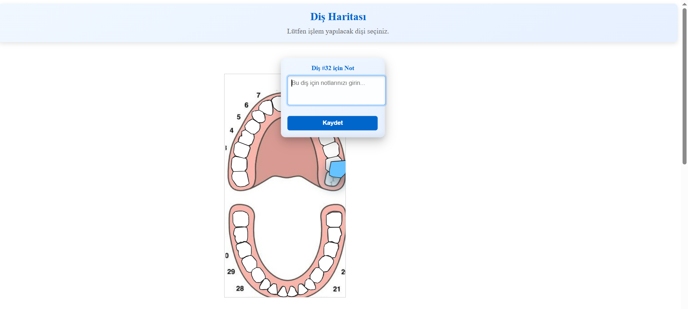
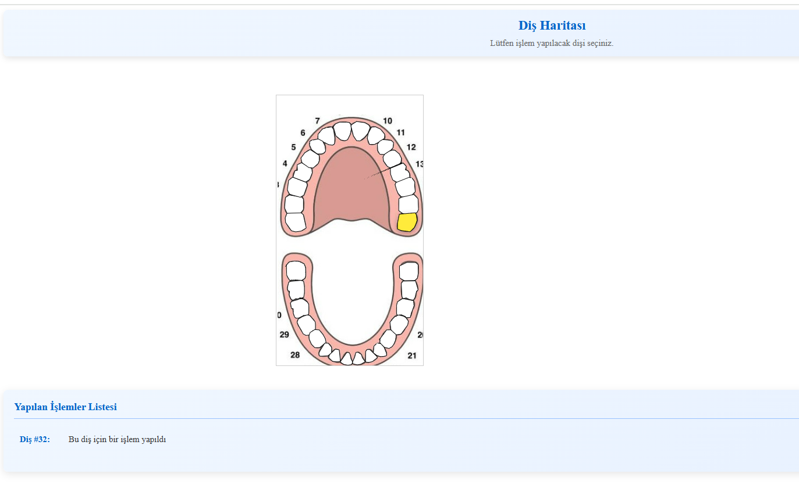
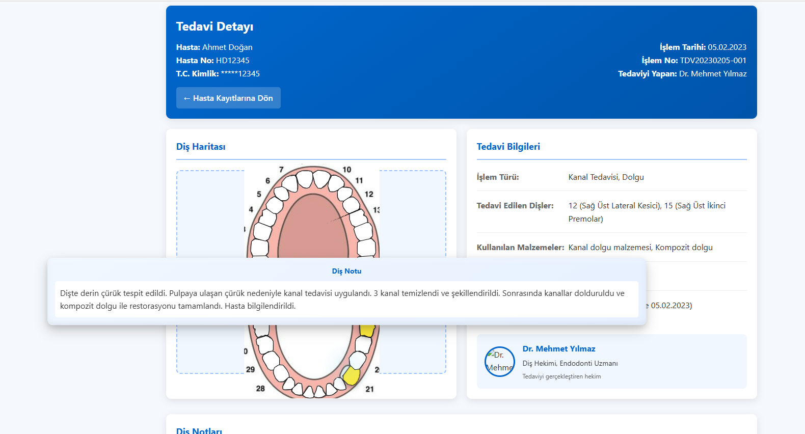
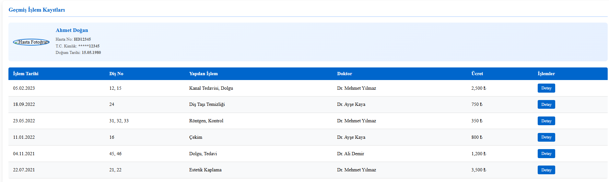
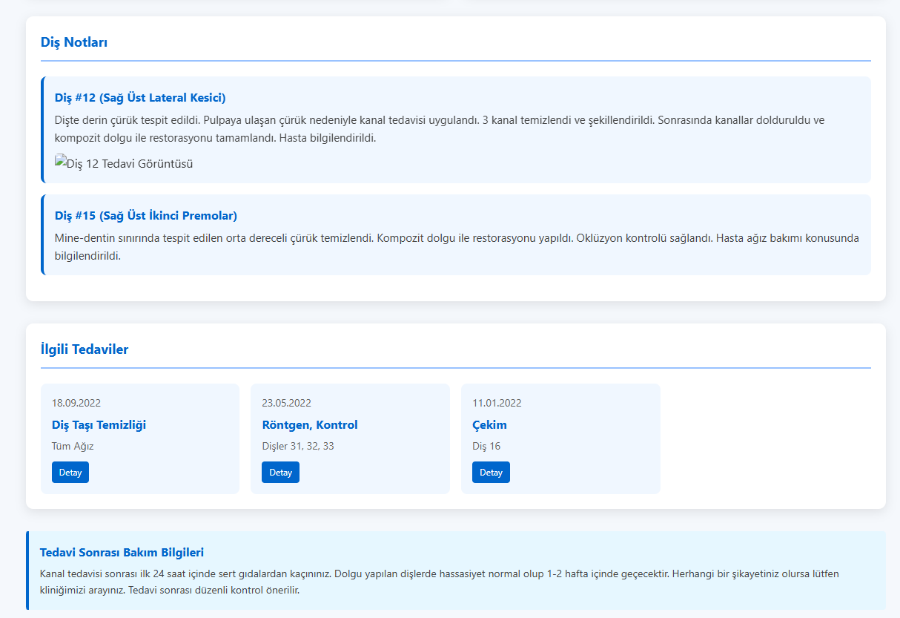

# Diş Haritası - Dental Charting System


## 📋 Proje Tanımı

Diş Haritası, diş hekimlerinin hasta tedavi kayıtlarını interaktif bir şekilde tutabilecekleri modern ve kullanıcı dostu bir web uygulamasıdır. Sistem, interaktif SVG tabanlı diş haritası üzerinden diş işlemlerinin kaydedilmesini, görüntülenmesini ve yönetilmesini sağlar.

### ✨ Demo

[](https://www.youtube.com/watch?v=example)

[🎬 Detaylı tanıtım videosunu izlemek için tıklayın](https://www.youtube.com/watch?v=example)

## 🚀 Özellikler

- **İnteraktif SVG Diş Haritası**: Dişlere tıklayarak interaktif not ekleyebilme
- **Tedavi Notları**: Her diş için özel tedavi notları ekleme ve görüntüleme
- **Hasta Geçmişi**: Detaylı hasta tedavi geçmişi ve kronolojik işlem kaydı
- **Görsel Efektler**: Seçilen dişler için görsel animasyonlar ve efektler
- **Responsive Tasarım**: Mobil ve masaüstü uyumlu arayüz
- **Detaylı Raporlama**: Tedavilerin kapsamlı raporları ve detayları

## 🛠️ Teknolojiler

- **Frontend**: HTML5, CSS3, JavaScript (Vanilla)
- **Grafikler**: SVG (Scalable Vector Graphics)
- **Animasyonlar**: CSS Animations, JavaScript Transitions
- **Veri Yönetimi**: JavaScript Object Notation (JSON)
- **Diğer**: Responsive Design, Flexbox, CSS Grid

## 📂 Proje Yapısı

```
dental-chart/
│
├── index.html                # Ana diş haritası sayfası
├── detay.html                # Tedavi detay sayfası
├── detay2.html               # Diş taşı temizliği detayları
├── detay3.html               # Röntgen ve kontrol detayları
├── detay4.html               # Diş çekim detayları
├── detay5.html               # Dolgu tedavi detayları
├── detay6.html               # Estetik kaplama detayları
│
├── css/
│   └── style.css             # Ana stil dosyası
│
├── images/
│   ├── dental-select.png       # Diş haritası SVG
│   └── ...                   # Diğer görseller
│
└── README.md                 # Proje dokümantasyonu
```

## 💻 Kurulum ve Kullanım

1. Bu depoyu klonlayın:

   ```bash
   git clone https://github.com/mehmetdogandev/dis-haritasi.git
   ```

2. Proje klasörüne gidin:

   ```bash
   cd dis-haritasi
   ```

3. `index.html` dosyasını favori tarayıcınızda açın:
   ```bash
   open index.html  # macOS
   # veya
   start index.html  # Windows
   ```

## 📱 Kullanım Kılavuzu

1. **Ana Ekran**: Diş haritası üzerinde işlem yapılacak dişi seçin
2. **Not Ekleme**: Seçilen diş için tanı veya tedavi notunu yazıp kaydedin
3. **Hasta Geçmişi**: Altta bulunan tedavi listesinden geçmiş işlemleri görüntüleyin
4. **Detay Sayfası**: Her tedavi için "Detay" butonuna tıklayarak ayrıntılı bilgilere erişin

## 🖼️ Ekran Görüntüleri

<div style="display: flex; flex-wrap: wrap; gap: 10px; justify-content: center;">
  
  
  
  
  
</div>

## 🌟 Teknik Detaylar

### SVG Diş Haritası

SVG (Scalable Vector Graphics) formatında oluşturulan diş haritası, her dişin benzersiz bir ID ve path elementi ile temsil edildiği interaktif bir grafiktir. SVG kullanımı, haritanın farklı ekran boyutlarında kalite kaybı olmadan görüntülenmesini sağlar.

```javascript
// Diş seçim örneği
svg.addEventListener("click", function (e) {
  let targetElement = e.target;
  while (targetElement && targetElement !== svg) {
    if (targetElement.tagName.toLowerCase() === "path") {
      const id = targetElement.getAttribute("id");
      // Diş işlemleri...
    }
    targetElement = targetElement.parentElement;
  }
});
```

### Diş Notları Sistemi

Dişlere ait tanı ve tedavi notları JavaScript objeleri içinde tutulur ve kullanıcı arayüzünde interaktif olarak görüntülenir.

```javascript
// Tedavi görmüş dişlerin ID'leri ve notları
const savedTeeth = {
  12: "Dişte derin çürük tespit edildi. Pulpaya ulaşan çürük nedeniyle kanal tedavisi uygulandı...",
  15: "Mine-dentin sınırında tespit edilen orta dereceli çürük temizlendi...",
};
```

### Görsel Efektler

Diş seçiminde kullanıcı deneyimini zenginleştirmek için CSS animasyonları ve JavaScript temelli efektler kullanılmıştır.

```css
@keyframes toothPop {
  0% {
    transform: translateY(0) scale(1);
  }
  50% {
    transform: translateY(-30px) scale(1.2);
  }
  100% {
    transform: translateY(-20px) scale(1.12);
  }
}
```

## 👥 Ekip

- **[Enes Bekik](https://github.com/enesbekik)** - SVG Diş Haritası Geliştirme
- **[Mehmet Doğan](https://github.com/mehmetdogandev)** - JavaScript Uygulaması ve Detay Sayfaları

## 📈 Gelecek Özellikler

- [ ] Hasta veritabanı entegrasyonu
- [ ] Çoklu kullanıcı desteği (hekimler için)
- [ ] 3D diş modelleri
- [ ] Tedavi plan çizelgesi
- [ ] Hasta randevu sistemi
- [ ] Mobil uygulama versiyonu

## 📄 Lisans

Bu proje [MIT Lisansı](LICENSE) altında lisanslanmıştır.

## 🙏 Teşekkürler

- SVG teknolojileri ve web arayüz tasarımı topluluklarına
- Tasarım ilhamı için modern diş hekimliği uygulamalarına
- Geri bildirim sağlayan tüm diş hekimleri ve test kullanıcılarına

---

Developed with ❤️ by [Mehmet Doğan](https://github.com/mehmetdogandev)
